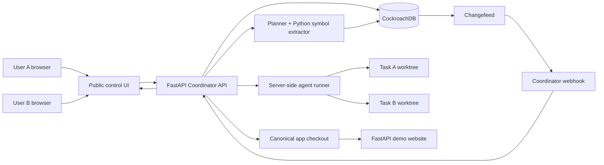
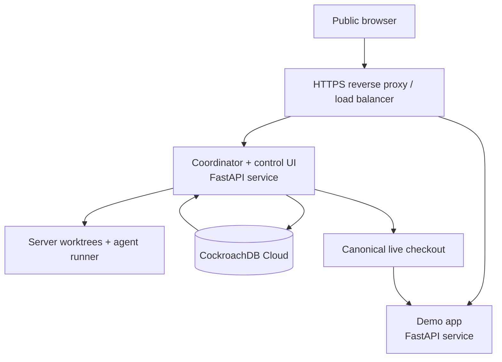

# CodeClaim: transactional semantic memory for collaborative coding agents

## 1. Executive summary

CodeClaim is a coordination and memory layer for coding agents that work on the same repository for different people. Before an agent changes code, it produces a structured plan of the Python symbols it expects to read, create, rewrite, and delete. The coordinator stores that plan, grants short-lived semantic claims, records every decision, and prevents unsafe concurrent work.

The central product promise is simple: **an agent cannot silently work from stale assumptions or overwrite another agent's in-progress work.**

CockroachDB is the durable memory and transaction system behind the product. It stores claims, task plans, code-symbol versions, deletion tombstones, compatibility decisions, wait states, audit events, deployments, and semantic embeddings. The coordinator is a deterministic service that uses that durable state to grant, block, wake, and re-plan agents.

The hackathon demo hosts a small Python web application on AWS. Two users submit change requests in a public control UI. Server-side agents modify isolated working copies of the same real project. When a change passes checks, the coordinator applies it to the live deployment checkout and reloads the website. Users can immediately see the result.

## 2. Problem and product thesis

Modern coding agents generally operate as if they are alone. In a shared repository, this produces late conflict discovery: agents independently make broad changes, and people discover conflicts only when Git branches are merged. The expensive part is often not resolving textual conflict markers; it is understanding two incompatible designs after both agents have already performed substantial work.

CodeClaim moves that decision earlier.

It coordinates at the **symbol level** rather than only at the file or branch level:

- A symbol can be a Python function, class, method, route handler, Pydantic model, module, template region, or migration.
- An agent declares its intended read, write, create, and delete set before implementation.
- A claim is a time-limited reservation over symbols that the coordinator grants transactionally.
- A deletion creates a tombstone rather than silently erasing memory of the symbol.
- A waiting agent is awakened only after the authoritative state changes and it has re-planned against the new revision.

The system addresses both forms of conflict:

| Conflict type | Example | Product behavior |
| --- | --- | --- |
| Exact write conflict | Both agents want to rewrite `create_session()` | Block the second write claim; offer wait, re-scope, or authorized override. |
| Dependency conflict | Agent B reads a function that Agent A will delete | Block or mark the plan stale; re-plan after Agent A finalizes. |
| Semantic incompatibility | Agent A requires verified accounts before a session; Agent B requests automatic login at signup | Warn User B with concrete evidence; require re-scope, an explicit override, or a human decision. |
| Stale-plan conflict | Agent B planned against commit `x`, but live code is now commit `y` | Reject the claim and require re-planning on `y`. |

## 3. Goals, non-goals, and scope

### Supported in v1 (Production-Grade)

- **Internal Python Services**: Microservices built with **FastAPI** and **Pydantic** models.
- **Protocols & Formats**: Synchronous **HTTP/JSON** APIs.
- **Contract Extraction**: Deterministic **OpenAPI-based contract extraction** via `codeclaim onboard` (importing `app.openapi()` or querying loopback `/openapi.json`).
- **Harness Integrations**: External coding harnesses (**Codex, Claude Code, Cursor**, or internal runners) integrated deterministically through the authenticated **CodeClaim REST API & MCP Server**.
- **Transactional Memory Plane**: **CockroachDB Cloud** as the authoritative transactional memory plane for contracts, dependencies, checkpoint metadata, append-only audit lineage, and outbox streams.
- **Semantic Discovery**: **AWS Bedrock embeddings** (Cohere Embed v4) as an optional semantic discovery mechanism for natural language candidate search.

### Future Roadmap Only (Explicitly Deferred)

- **gRPC / Protobuf**: Interface extraction, Protobuf descriptor parsing, and compatibility analysis.
- **GraphQL**: Schema and operation AST extraction and query compatibility analysis.
- **Events & Message Queues**: Event-driven architectures and **AsyncAPI** contract schemas.
- **Polyglot & Framework Adapters**: Non-Python ecosystems (TypeScript/Node.js, Go, Rust, Java/Kotlin) and other Python frameworks (Django, Flask).
- **Third-Party Dependencies**: External SaaS/vendor SDK monitoring and public API documentation scraping.

### Authoritative Memory vs. Semantic Discovery

- **Authoritative System of Record**: CockroachDB is the sole source of truth for all contracts, exact HTTP endpoint dependencies, plan revisions, checkpoint state, audit history, and outbox events.
- **Auxiliary Semantic Discovery**: Embeddings provide candidate discovery only. **Embeddings never prove compatibility** and **never register dependencies automatically**.

### Non-goals for the MVP

- Claim automatic support for unsupported frameworks, languages, or protocols without a tested, deterministic machine-readable contract adapter.
- Prove perfect semantic understanding of arbitrary code or natural-language requirements without human decision-making.
- Replace Git, code review, test suites, or human authorization.
- Allow arbitrary LLM agents to write directly into the live deployment directory or perform direct database writes.
- Implement an autonomous product-decision engine. The coordinator enforces policy deterministically; it escalates ambiguous design incompatibilities to human engineers.

### MVP scope

- Internal Python FastAPI microservices (`billing-service`, `orders-service`).
- OpenAPI v3 contract schemas extracted deterministically from Pydantic models.
- Optimistic parallel agent work with safe checkpoint validation.
- CockroachDB Cloud transactional outbox and CDC changefeed stream.
- Central coordinator API, deterministic differencer, and 3-panel control dashboard.

## 4. Product vocabulary

| Term | Meaning |
| --- | --- |
| Task | A user's requested code change and its lifecycle. |
| Agent run | One attempt by an LLM coding agent to execute a task. A task can have multiple runs after re-planning. |
| Plan | Structured intent: base revision, read set, write set, create set, delete set, tests, and expected behavior. |
| Symbol | A stable code identity, for example `app.auth.service.create_session`. |
| Claim bundle | A transactionally granted set of symbol claims needed for one coherent unit of work. |
| Lease | The expiration attached to a claim. Expired claims are not permanent locks. |
| Tombstone | Durable record that a symbol was deleted or renamed, by whom, in which commit, and what replaces it. |
| Semantic contract | A concise structured description of an intended behavior or invariant. |
| Compatibility finding | Evidence that two plans are compatible, need a re-plan, or appear incompatible. |
| Wait request | Durable record that an agent is blocked and should be reconsidered when a condition changes. |

## 5. User experience

### User A submits a change

User A opens the public control page and writes:

> Require email-verified users before allowing login sessions.

The UI shows task stages in real time:

```text
Planning → Claims granted → Agent editing → Tests running → Deployed
```

### User B submits an overlapping request

While Agent A is running, User B requests:

> Automatically sign users in immediately after they complete sign-up.

The coordinator's preflight plan detects that both tasks need the authentication policy and session-creation symbols. It also finds contradictory semantic contracts:

```text
User A: a session requires email_verified = true
User B: create a session immediately after registration
```

User B sees a clear, non-technical warning:

```text
Your request may conflict with User A's active authentication change.

Shared area: session creation and account-verification policy
Why: User A is making verified email a prerequisite for a session.
Your requested automatic sign-in would create a session before verification.

[Wait for User A's change] [Revise request] [Request maintainer override]
```

The system must not tell User B that the change is definitely impossible. It should explain the evidence and state that a re-plan is required after Agent A finishes. A human can choose a product policy; the coordinator cannot make that decision on its own.

When Agent A deploys, User B receives:

```text
Authentication policy changed. Your task is ready to re-plan against version 12.
```

Agent B re-reads the new code. It may propose a compatible revision such as:

> Create the account at sign-up, show a verification-pending page, and create a session only after email verification.

The user approves that revised intent before Agent B receives write claims.

## 6. Critical implementation decision: never let concurrent agents edit the live directory

The request says agents should affect real files on the AWS server. That is correct for a compelling demo, but **two agents must not write concurrently to the same deployed working tree**. Doing so creates partial files, accidental reloads, and state that cannot be attributed to one task.

Use this model instead:

```text
canonical deployment checkout        /srv/codeclaim/app-live
Agent A isolated worktree            /srv/codeclaim/worktrees/task-A
Agent B isolated worktree            /srv/codeclaim/worktrees/task-B
```

The files are all real server files. Agents edit their assigned worktrees. After a task is finalized, the coordinator:

1. Verifies the task's lease, base revision, claims, tests, and policy checks.
2. Applies the approved patch or fast-forward commit to the canonical checkout.
3. Records a deployment version in CockroachDB.
4. Reloads the Python service only after the update is complete.
5. Releases claims and emits the corresponding events atomically from the coordinator's perspective.

This is the minimum isolation needed for the demo to be credible. It still demonstrates real-time changes on a real server, without turning the live page into an unsafe shared scratchpad.

## 7. High-level architecture



### Responsibility boundaries

| Component | Responsibility |
| --- | --- |
| Public control UI | Collect requests; display task status, conflict warnings, audit timeline, and deployed version. |
| Coordinator | Deterministic state machine; validates claims; queues tasks; creates wait requests; authorizes finalize/deploy; exposes APIs. |
| Planner | LLM-assisted but structured planning. Produces proposed symbols, intent, expected tests, and semantic contract. It does not grant itself permission. |
| Symbol extractor | Parses Python code into stable identifiers and dependency metadata. |
| Agent runner | Runs the coding agent only in a task-specific worktree and only after claims are granted. |
| CockroachDB | Source of truth for memory, coordination, auditability, vector retrieval, and durable event delivery. |
| Changefeed/webhook | Delivers durable state-change notifications to the coordinator. |
| Deployer | Applies an approved revision to the canonical checkout and triggers a safe reload. |
| Demo website | The actual application users inspect before and after deployment. |

## 8. CockroachDB as the hero

CockroachDB is not a passive log database in this design. It is the coordination plane that makes the product possible.

### Transactional coordination

Claim grants, claim releases, tombstones, task state, wait requests, audit entries, and outbox events are written in serializable transactions. Two agents trying to claim the same symbol cannot both receive a valid exclusive claim.

### Durable agent memory

The database stores both structured memory and semantic memory:

| Memory type | Examples | Why it matters |
| --- | --- | --- |
| Transactional memory | Current owner, lease expiry, base commit, deployment version, allowed transitions | Correctness and coordination. |
| Episodic memory | Agent runs, plans, test results, conflicts, human decisions | Auditability and learning from prior work. |
| Code memory | Symbol summaries, dependencies, symbol versions, tombstones | Accurate re-planning after changes. |
| Semantic memory | Embeddings of symbol summaries, requirements, and earlier conflict resolutions | Finds related code and near-conflicts beyond exact symbol overlap. |

Use CockroachDB vector search to retrieve semantically related Python symbols and past compatibility decisions during planning. The retrieved items expand the *candidate* read/write set. They never independently grant a lock; the coordinator still uses explicit symbol claims and transactions for enforcement.

### Changefeed as the event spine

Each coordinator transaction inserts a single domain event into `coordinator_outbox`. A CockroachDB changefeed sends that table to the coordinator webhook. This lets blocked tasks wake quickly, supports the live UI timeline, and gives the demo a visible event stream.

The consumer must be idempotent: changefeeds are notification delivery, not the only source of truth. The coordinator deduplicates by event ID and re-reads authoritative claim state before taking action.

### Deployment & Hosting Topology

The coordinator and mission control dashboard are co-located in a single deployment unit on AWS:

- **Single Process/Container Service**: FastAPI hosts the coordinator REST API, serves the dashboard HTML/CSS/JS (`/static`, `/control`, `/`), and supervises background workers (`drift_worker`, `compatibility_dispatcher`, `slack_notifier`) in its application lifespan.
- **Same-Origin Dashboard Access**: The UI communicates strictly through same-origin paths (`/api/dashboard/state`, `/deploy/version`, etc.), eliminating external frontend servers and cross-origin security concerns.
- **External Source of Truth**: CockroachDB Cloud is the external, durable transactional memory plane.
- **HTTPS Reverse Proxy**: The coordinator is fronted by an HTTPS reverse proxy (Nginx or AWS ALB); the internal FastAPI port (8000) is kept private on loopback.

```text
https://codeclaim.example.com
          |
          v
AWS EC2 / container
  ├─ HTTPS reverse proxy (Nginx / ALB on port 443)
  └─ FastAPI CodeClaim coordinator (127.0.0.1:8000)
      ├─ dashboard HTML/CSS/JS
      ├─ coordinator APIs
      ├─ drift worker
      ├─ compatibility dispatcher
      └─ Slack notifier
          |
          v
CockroachDB Cloud
```

### Multi-region story

The MVP can use one CockroachDB Cloud region. The production story is stronger: a multi-region CockroachDB deployment can place coordination data close to distributed development teams while preserving one consistent transactional system of record. The coordinator's stateless replicas can run near users; all decisions still resolve against the same durable state.

## 9. Core data model

These are conceptual tables; the first implementation can omit lower-priority columns but must retain the identifiers and lifecycle state.

| Table | Key fields | Purpose |
| --- | --- | --- |
| `repositories` | `repository_id`, canonical path, current commit | Registered codebase. |
| `workspace_versions` | repository, commit SHA, deployment version | Links plans and deployments to exact code state. |
| `tasks` | task ID, requester, request text, state, base commit | User-visible unit of work. |
| `task_plans` | plan ID, task ID, revision, JSON plan, semantic contract | Immutable planning attempts. |
| `symbols` | symbol ID, file path, AST identity, current version, summary embedding | Code-memory index. |
| `symbol_dependencies` | source symbol, target symbol, dependency type | Helps expand semantic claim bundles. |
| `claims` | claim ID, task/agent ID, state, lease expiry, base commit | Header for a granted claim bundle. |
| `claim_members` | claim ID, symbol ID, mode (`read`, `write`, `delete`, `create`) | Per-symbol reservation. |
| `tombstones` | deleted symbol, replacement symbol, deleting commit, task | Makes deletion explicit and re-plannable. |
| `compatibility_findings` | compared plans, result, evidence, confidence, human decision | Captures overlap and semantic conflict assessment. |
| `wait_requests` | task/plan, blocking symbols, required revision, state | Durable blocked-task queue. |
| `agent_runs` | run ID, task ID, worktree, model metadata, test outcome | Execution audit. |
| `audit_events` | event ID, actor, action, entity, timestamp, payload | Human-readable timeline and compliance log. |
| `coordinator_outbox` | event ID, type, aggregate version, payload | Changefeed target. |
| `event_inbox` | event ID, received timestamp, processing status | Webhook de-duplication. |
| `deployments` | deployment ID, commit, status, health check, reload version | Safe live-update record. |

### Essential invariants

1. A write or delete claim is granted only if no active conflicting claim exists for the same repository and symbol.
2. A task may edit only through a worktree tied to its active claim and base revision.
3. A task cannot finalize against a newer canonical revision without re-planning.
4. Symbol deletion always records a tombstone in the same transaction as the new symbol state and claim release.
5. The deployment checkout changes only after tests pass and coordinator verification succeeds.
6. Each outbox event has a unique, immutable ID; consuming it repeatedly produces the same final state.
7. A user-visible semantic conflict requires a human decision or a revised request. It cannot be silently overridden by the LLM.

## 10. Plan contract and claim policy

Every agent begins with a read-only planning phase. It returns a machine-checkable plan like:

```json
{
  "base_commit": "a1b2c3d",
  "read_symbols": ["app.auth.routes.login", "app.auth.service.create_session"],
  "write_symbols": ["app.auth.service.create_session"],
  "create_symbols": [],
  "delete_symbols": [],
  "template_regions": ["templates/auth/login.html#login-form"],
  "semantic_contract": {
    "invariants_added": ["Only email-verified users may receive an authenticated session"],
    "invariants_removed": [],
    "user_visible_outcome": "Unverified users are directed to email verification"
  },
  "tests": ["pytest tests/test_auth.py -k verified_login"]
}
```

The coordinator validates the plan in this order:

1. Confirm the plan is based on the current canonical commit.
2. Resolve symbol identities and expand direct dependencies into a candidate semantic bundle.
3. Find active exact write/delete conflicts.
4. Compare the plan's semantic contract with active or recently finalized contracts that touch related symbols.
5. Return one of: `GRANTED`, `BLOCKED`, `WARNING_REPLAN`, `WARNING_INCOMPATIBLE`, or `REJECTED_STALE`.
6. Only `GRANTED` permits the agent runner to write in its worktree.

### Deterministic versus LLM behavior

The planner may use an LLM and vector retrieval to propose symbols and identify likely incompatibilities. That is advisory.

The coordinator remains deterministic:

- It has an explicit state-transition table.
- It grants claims only through database transactions.
- It blocks based on claim modes, base revision, lease state, policy rules, and recorded human decisions.
- It treats semantic-incompatibility output as a warning with evidence, not a self-executing product decision.

## 11. State machines

### Task state

```text
REQUESTED
  → PLANNING
  → AWAITING_USER_DECISION       (semantic warning)
  → WAITING_FOR_CLAIM            (exact/dependency conflict)
  → CLAIMED
  → EXECUTING
  → VALIDATING
  → READY_TO_DEPLOY
  → DEPLOYING
  → DEPLOYED

Failure exits: REJECTED_STALE, FAILED, CANCELLED, EXPIRED
```

### Claim state

```text
PROPOSED → ACTIVE → RELEASED
                  ↘ EXPIRED
                  ↘ INVALIDATED_BY_TOMBSTONE
```

### Compatibility state

```text
UNKNOWN → COMPATIBLE
        → BLOCKED_BY_EXACT_CLAIM
        → REQUIRES_REPLAN
        → LIKELY_INCOMPATIBLE → USER_RESCOPED | OVERRIDDEN | CANCELLED
```

## 12. Main workflows

### A. A normal request

1. User submits request through the public UI.
2. Coordinator creates `task` and `agent_run` in `PLANNING` state.
3. Planner examines the canonical revision in read-only mode and stores `task_plan`.
4. Coordinator transaction grants a claim bundle.
5. Agent runner receives a task-specific server worktree and writes only there.
6. Agent runs the declared tests and produces a patch/commit plus updated symbol summaries.
7. Coordinator verifies lease, base revision, claim ownership, tests, and expected changed symbols.
8. Deployer applies the change to the canonical checkout, verifies health, increments the deployment version, and reloads the site.
9. Coordinator releases claims, writes audit/outbox events, and surfaces the deployment in the UI.

### B. Agent B encounters an exact conflict

1. Agent B's plan needs `app.auth.service.create_session` in write mode.
2. CockroachDB shows an active write claim owned by Agent A.
3. The claim transaction fails safely; Agent B never starts editing.
4. Coordinator writes a `wait_request` containing the blocking symbol and required next revision.
5. UI displays the blocked state and appropriate user choices.
6. Agent A finalizes. Its transaction releases claims and inserts `SYMBOL_RELEASED` / `DEPLOYMENT_COMPLETED` outbox events.
7. Changefeed posts the events to the coordinator webhook.
8. Coordinator marks Agent B ready to re-plan. Agent B retrieves the new canonical revision and creates a new plan.

### C. Semantic incompatibility warning

1. User B's plan overlaps an active or finalized semantic contract.
2. A rule-and-retrieval evaluator finds an explicit contradiction, for example `session requires verified email` versus `session is created immediately after registration`.
3. Coordinator stores the evidence in `compatibility_findings`.
4. UI warns User B before any write claim is issued.
5. User B may revise the request, wait, cancel, or ask a maintainer to override.
6. An override is an audited human action with scope, reason, and expiry. It never silently grants an unrestricted lock.

### D. Deletion and rename

1. Agent A's plan declares it will delete `app.auth.service.create_session`.
2. Coordinator checks dependent symbols and blocks plans that rely on it.
3. On finalization, Agent A records a tombstone with optional replacement symbol.
4. Any waiting plan that reads/writes the deleted symbol becomes `REQUIRES_REPLAN`.
5. Agent B re-plans against the updated symbol graph; it cannot continue from a now-invalid reference.

### E. Lease expiry, crash, or abandonment

1. Claims have a bounded lease and heartbeat.
2. If an agent runner dies, the coordinator marks the run failed after the heartbeat window.
3. Claims expire transactionally and an outbox event wakes affected waiting tasks.
4. The abandoned worktree is retained briefly for inspection, then cleaned up by an auditable maintenance job.

## 13. Event-driven coordinator integration

The event route is intentionally narrow:

```text
CockroachDB outbox → Changefeed → POST /events/cockroach → Coordinator inbox
```

The coordinator does not watch raw claim-table changes directly. The outbox carries explicit domain events such as:

- `CLAIM_GRANTED`
- `CLAIM_RELEASED`
- `SYMBOL_TOMBSTONED`
- `TASK_REPLAN_REQUIRED`
- `DEPLOYMENT_COMPLETED`
- `LEASE_EXPIRED`

Example transaction:

```text
release claim members
write tombstone, if needed
update task / deployment state
insert audit event
insert coordinator_outbox event
commit
```

The webhook handler accepts the changefeed batch, authenticates it, inserts each event into `event_inbox` with `ON CONFLICT DO NOTHING`, and only then processes it. Returning HTTP success before durable ingestion would lose the reliability benefit.

For the MVP, browsers poll task status every one or two seconds. This is simple and sufficient. The coordinator can later add Server-Sent Events or WebSockets without changing correctness: the database state remains the source of truth.

## 14. AWS demo deployment

### Recommended minimal topology



For a fast demo, one AWS EC2 instance is enough:

| Service | Suggested port | Notes |
| --- | --- | --- |
| Reverse proxy | `443` | Public entry point; route `/control` and `/demo`. |
| Coordinator API/control UI | `8000` | Internal behind proxy; FastAPI. |
| Demo website | `8001` | Internal behind proxy; FastAPI. |
| CockroachDB | Managed cloud endpoint | Do not expose database ports publicly. |

If the judges need direct separate ports, temporarily expose `8000` for the control UI and `8001` for the demo app. For a more production-ready presentation, expose only HTTPS and route by path or subdomain:

```text
https://demo.example.com/control    → coordinator UI
https://demo.example.com/app        → target web application
```

The coordinator service receives CockroachDB changefeed webhooks at an HTTPS endpoint such as `/events/cockroach`. It must be reachable from CockroachDB Cloud; do not point a cloud changefeed at `localhost`.

### Python technology selection

| Need | Python implementation |
| --- | --- |
| Coordinator API | FastAPI + Pydantic + Uvicorn/Gunicorn |
| Database access | `psycopg` or SQLAlchemy using CockroachDB's PostgreSQL wire protocol |
| Public control UI | Server-rendered Jinja templates or a very small static HTML/JavaScript page served by FastAPI |
| Target app | FastAPI + Jinja templates + CSS/vanilla JavaScript |
| Agent runner | Python subprocess worker calling the selected coding-agent API/SDK |
| Python symbols | `ast` for MVP; Tree-sitter Python if richer references are needed |
| Worktree management | `git worktree` invoked safely from Python |
| Tests | `pytest` |
| Logs and metrics | Python structured logging; CockroachDB audit events; optional OpenTelemetry |

## 15. Live reload and safe deployment

There are two different things to reload:

1. **Python server code**: restart or reload the FastAPI target process after an approved deployment.
2. **The browser page**: tell open browsers that a new deployment version is available.

For the demo, use this safe sequence:

1. Agent edits its isolated worktree.
2. Tests pass.
3. Coordinator applies the approved change to `/srv/codeclaim/app-live` atomically.
4. Coordinator increments `deployments.reload_version` in CockroachDB.
5. Target service is restarted or run with Uvicorn's development `--reload` watcher.
6. The demo page polls `/demo/version` every two seconds. If its version changes, it displays “New version deployed” and reloads the browser page.

For a hackathon, Uvicorn `--reload` is acceptable. In any production-shaped version, prefer a controlled process restart after an atomic release switch, because reloaders must never observe half-written code.

Minimal browser logic:

```javascript
let deployedVersion = null;
setInterval(async () => {
  const { version } = await fetch('/demo/version').then(r => r.json());
  if (deployedVersion && version !== deployedVersion) location.reload();
  deployedVersion = version;
}, 2000);
```

## 16. Public UI design

The control UI should demonstrate coordination, not hide it.

### Main screen

- Request form: “Describe the change you want.”
- Current deployed version and app link.
- Task list with user, status, active claim count, and timestamp.
- Live event timeline sourced from `audit_events`.

### Task detail drawer

- User request and the agent's structured plan.
- Symbols read, written, created, and deleted.
- Claim state and lease expiry.
- Exact blocking symbols.
- Semantic compatibility findings, including evidence and confidence.
- Test status and deployment version.
- User actions: cancel, revise request, wait, or request authorized override.

### Demo-visible states

```text
Planning
Claimed: 3 symbols
Blocked: app.auth.service.create_session
Warning: incompatible authentication policy
Re-planning against deployment version 12
Testing
Live on version 13
```

## 17. Security and safety controls

- Use one service account for the coordinator with least-privilege database rights. Agents do not get unrestricted database credentials.
- Expose agent actions through a constrained coordinator API or MCP facade: plan, claim, heartbeat, submit patch, test result, finalize. Do not expose arbitrary SQL or arbitrary shell execution.
- Authenticate users; record requester identity on every task, decision, and override.
- Protect the changefeed webhook with TLS and authentication; validate payload schema.
- Keep secrets in AWS Secrets Manager or environment injection, not source code or changefeed SQL strings.
- Apply per-task filesystem boundaries. Agent runner may write only in its assigned worktree.
- Set resource limits and timeouts for each agent run.
- Require explicit authorization for `override` and for any deployment that changes security-sensitive code.
- Redact prompts and code content from public views if the demo uses a non-public repository.
- Preserve an append-only audit record of who requested, approved, blocked, released, deployed, or overrode a change.

## 18. Observability and judging evidence

The demo needs to prove that the system is real rather than a UI mock.

Display or log:

- Claim-grant transaction result and conflicting claim ID.
- Current base commit and post-deploy commit.
- Changefeed event ID arriving at the coordinator webhook.
- Wait request becoming ready after Agent A finalizes.
- Semantic contract comparison that explains User B's warning.
- Tests run and outcome before deployment.
- Reload/deployment version visible in the target web app.

Useful metrics:

- Time from request to plan.
- Claim contention count.
- Time spent waiting for a claim.
- Re-plan count.
- Lease expiry count.
- Changefeed/webhook processing latency.
- Test and deployment success rate.

## 19. Build plan

### Phase 0 — Bootstrap the demo app

**Output:** a small FastAPI login/sign-up page deployed on AWS, with test coverage and a visible deployment version.

- Create `app-live` repository with login, sign-up, session helper, and email-verification policy.
- Add `pytest` tests for sign-in and sign-up behavior.
- Add `/demo/version` and browser version polling.
- Deploy behind HTTPS.

**Exit criteria:** a manual edit followed by controlled reload visibly updates the demo page.

### Phase 1 — Coordinator and core schema

**Output:** FastAPI coordinator connected to CockroachDB.

- Create core tables: tasks, plans, claims, claim members, audit events, outbox, deployments.
- Implement deterministic task and claim state transitions.
- Add `POST /tasks`, `GET /tasks/{id}`, and `GET /tasks`.
- Add a simple control UI list and task status page.

**Exit criteria:** two manually-created tasks can be stored, listed, and audited.

### Phase 2 — Python plan and exact symbol claims

**Output:** read-only planner plus transactional exclusive write claims.

- Parse Python symbols from the canonical revision.
- Require the structured plan contract.
- Implement read/write/create/delete modes and leases.
- Return clear exact-conflict responses.

**Exit criteria:** two tasks requesting the same Python function cannot both receive a write claim.

### Phase 3 — Worktrees and agent runner

**Output:** agents can safely make real server-side changes.

- Create a worktree per granted task.
- Run the coding agent against only that worktree.
- Enforce declared changed-symbol validation after the agent completes.
- Run task tests and collect patches/commits.

**Exit criteria:** an agent changes a task worktree but cannot modify the canonical live checkout directly.

### Phase 4 — Finalization, deploy, and live reload

**Output:** approved work reaches the live page safely.

- Verify base revision and claim ownership before finalization.
- Apply patch/commit to canonical checkout.
- Record deployment state, bump version, and reload the target app.
- Release claims only after a successful deployment or capture a recoverable failed-deployment state.

**Exit criteria:** a successful task visibly changes the live site and records a deployment event.

### Phase 5 — Changefeed-driven wake-up

**Output:** blocked tasks move from waiting to ready without manual coordination.

- Add `coordinator_outbox` events to all relevant transactions.
- Configure CockroachDB changefeed to the coordinator webhook.
- Add idempotent `event_inbox` handling.
- Turn a released/tombstoned symbol into a `REPLAN_REQUIRED` state for affected tasks.

**Exit criteria:** Agent B is blocked, Agent A finalizes, and Agent B visibly becomes ready to re-plan.

### Phase 6 — Semantic compatibility warning and vector memory

**Output:** User B receives an evidence-backed warning before Agent B edits.

- Store semantic contracts for tasks and symbol summaries.
- Add embeddings and CockroachDB vector retrieval for related symbols/contracts.
- Add explicit deterministic contradiction rules for the demo domain, such as verified-session policy versus immediate auto-login.
- Persist and present compatibility findings and human decisions.

**Exit criteria:** the login/sign-up scenario produces a warning, a wait/re-plan flow, and a user-visible resolution path.

## 20. Demo script for judges

1. Open the current FastAPI demo site. It shows version `11` and the existing authentication flow.
2. Open the control UI in two browser windows, labelled User A and User B.
3. User A submits: “Require verified email before login creates a session.”
4. Show Agent A's plan, its claim of `create_session` and verification-policy symbols, and its worktree status.
5. While Agent A runs, User B submits: “Automatically sign users in immediately after sign-up.”
6. Show the exact claim overlap and the semantic warning. User B selects **Wait for User A's change**.
7. Agent A runs tests, finalizes, deploys, and the demo app reloads to version `12`.
8. Show the CockroachDB outbox event, changefeed webhook receipt, and Agent B becoming `REPLAN_REQUIRED`.
9. Agent B re-plans against version `12`. Show its revised compatible proposal: account created at sign-up, verification-pending page, session after verification.
10. User B approves the revised plan. Agent B receives claims, changes its worktree, passes tests, and deploys version `13`.
11. Refresh is automatic; show the updated sign-up UX on the target website.
12. End on the audit timeline: request → plan → claim → block/warning → re-plan → test → deploy.

## 21. Risks and explicit mitigations

| Risk | Mitigation |
| --- | --- |
| LLM plans omit a symbol | Post-run AST diff validates changed symbols; unclaimed changes are rejected or require an amended plan. |
| Semantic classifier is wrong | Treat it as warning evidence, not autonomous policy; require human resolution. |
| Agent crashes while holding claims | Leases, heartbeats, expiry events, and worktree retention for inspection. |
| Changefeed duplicate or delayed | Idempotent inbox and authoritative database re-check before acting. |
| Deployment breaks live site | Run tests before deployment; retain prior commit and use a rollback action. |
| Same live directory is edited concurrently | Never permit it; use per-task worktrees and atomic canonical deployment. |
| Scope becomes too large | Keep first demo to one repository, FastAPI, two auth flows, exact symbol claims, and one semantic rule family. |

## 22. What makes this a strong CockroachDB hackathon project

- **Agentic Memory Design:** CockroachDB stores the durable multi-layer memory that agents need to coordinate, recover, and re-plan.
- **Technological Implementation:** serializable claims, changefeed webhook delivery, vector retrieval, durable audit/outbox patterns, and a constrained coordinator API show real engineering rather than toy retrieval.
- **Real-World Impact:** teams increasingly run multiple coding agents against shared codebases; early semantic conflict discovery attacks expensive rework.
- **Product Readiness:** leases, tombstones, idempotency, isolated worktrees, test gates, live-deployment versioning, and auditability make the design credible.
- **Creativity and Originality:** it treats code symbols and behavioral contracts as shared agent memory, and uses them to coordinate work before merge conflicts exist.

## 23. Final MVP definition

Build the smallest credible version first:

> Two users submit authentication changes through a public web UI. A Python-only coordinator uses CockroachDB to plan, claim, block, audit, and re-plan two server-side coding agents. The agents work in isolated server worktrees, not the live directory. After successful tests, their changes are deployed to a FastAPI website with visible live reload. The second user receives both an exact-conflict wait state and an evidence-backed semantic incompatibility warning.

If that works end-to-end, the project has already demonstrated the central thesis. More languages, IDE integration, WebSockets, advanced embeddings, multi-region deployment, and automated resolution can follow without changing the core architecture.
